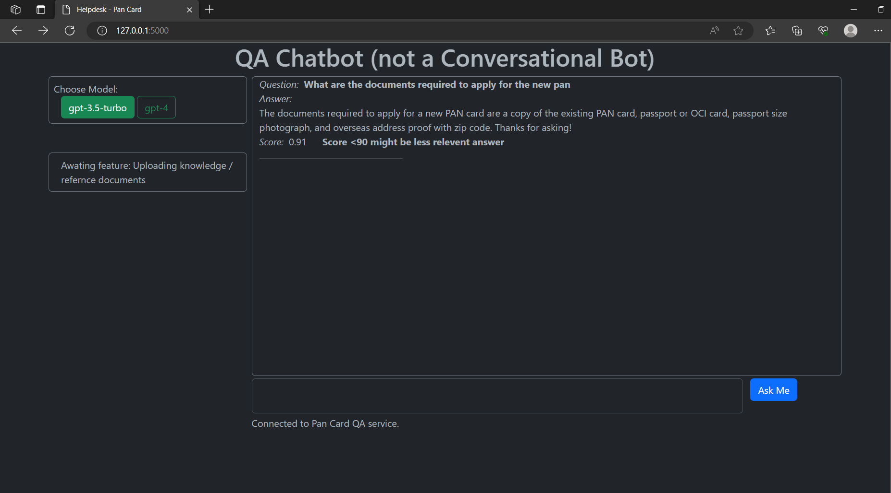
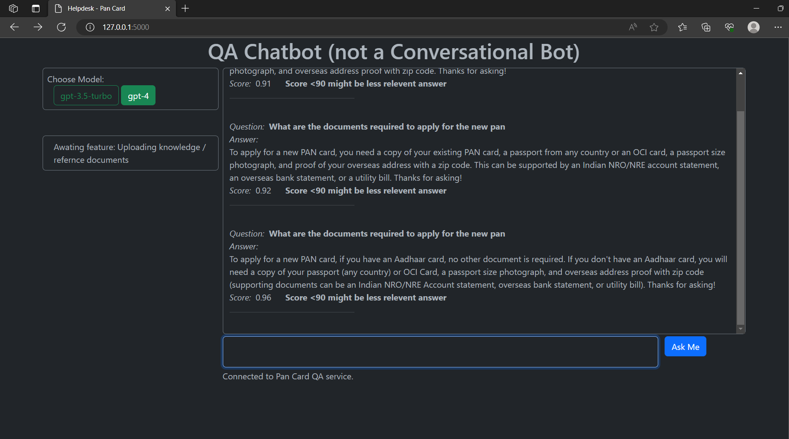

# RAG (Retrieval Augmented Generation) based Question Answering Service

Uses OpenAI API embedding and LLM model for answering the pan card related questions.

GUI using flask and socket.io with bootstrap frontend.

### Features
- Uses RAG (Retrieval Augmented Generation) 
- Simple dot product-based metric for question-answer evaluation
- Based on WebSocket technology for chat connectivity

### Features may come in future
- Opensource embeddings and LLM support instead of OpenAI API
- Support for uploading Knowledge Documents from front end
- Support for multiple vectordb
- Multiple metric options for question-answer evaluation like BERT_Score, Perplexity, QAEval, etc
- Support for multi-linguality
- Adding speech capabilities - taking questions in voice, and outputting responses in voice

### Assumptions
- Embeddings model and LLM are fine tuned for given domain knowledge, in our case PAN card related knowledge

### Limitations
- Scoring mechanism is dependent on curated question-answers by humans, we can automate this using automated QA generation techniques based on given knowledge documents, of course we will still need at least one human review for such generated question-answers.

### Limitations
- Validation related bugs will be there.
- few GUI related bugs will be there.

# To run the server
Make sure to update 'OPENAI_API_KEY' in config.yaml for accessing OpenAI API.

    pip install -r "requirements.txt"
    python main.py

### Sample preview
- gpt-3.5-turbo sample answer 

- gpt-3.5-turbo sample answer 

